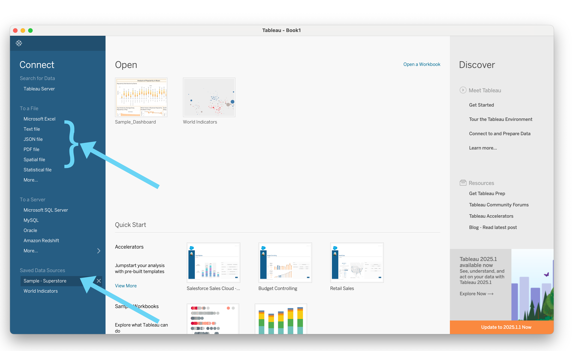
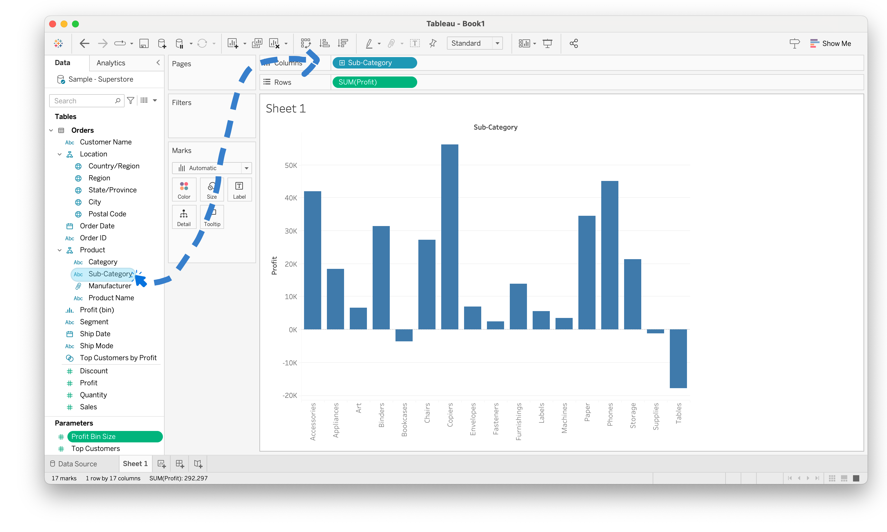
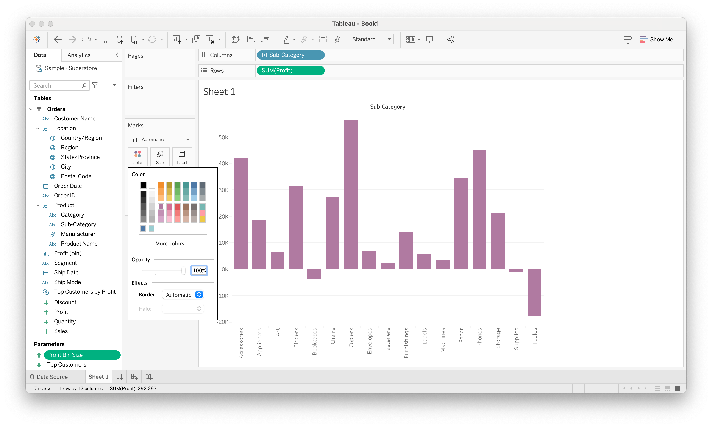
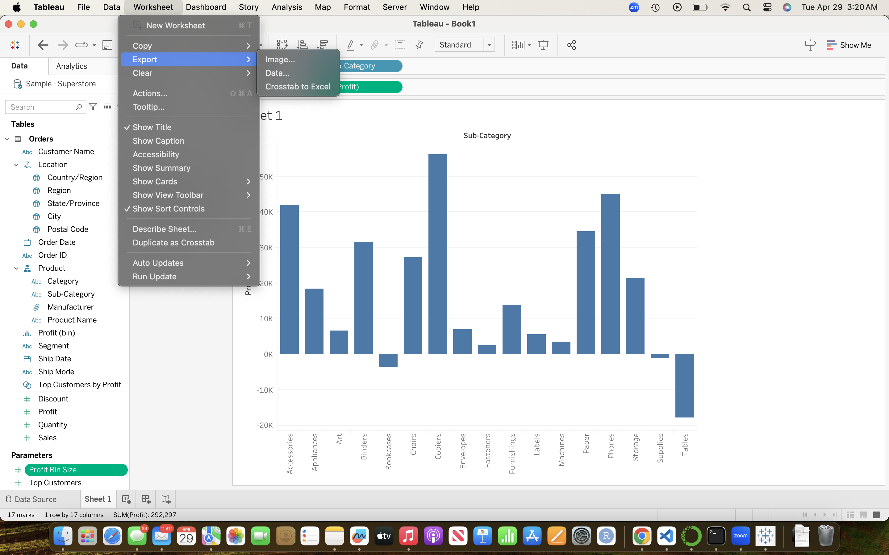

# How to Create a Bar Graph in Tableau

Welcome! This tutorial will walk you through the steps of creating a simple, effective bar graph using Tableau.

## 🛠️ Requirements

- [Tableau Public](https://public.tableau.com/en-us/s/download/) (Free download)
- A dataset (you can use one of these [sample datasets](https://public.tableau.com/app/learn/sample-data?qt-overview_resources=1) or your own)

---

## 📊 Step 1: Open Tableau and Connect to Data

1. Open Tableau Public or Tableau Desktop.
2. Click **"Connect to Data"** and select your file type which will most likely be **Microsoft Excel** or **Text File (CSV)**.
3. Data sets you have worked with in Tableau will populate under **Saved Data Sources**.
4. Choose your dataset file and click **Open**.

---

## 📈 Step 2: Build a Bar Graph

1. In the **Data pane**, drag a **categorical variable** (e.g., `Department`, `Category`, or `Product Name`) to the **Columns** shelf.
2. Drag a **numeric measure** (e.g., `Sales`, `Profit`, or `Quantity`) to the **Rows** shelf.
3. Tableau will automatically generate a bar graph!

---

## 🎨 Step 3: Customize Your Chart

- Click the **Color** shelf to change bar colors.
- Use **Labels** to show values on each bar.
- Sort the bars by value using the **Sort** button.
- Change the chart title by double-clicking it.

---

## 📤 Step 4: Export 

- Click **Worksheet > Export > Image** to save your graph.

---

## ⚠️ Common Mistakes

- Bars not appearing? Make sure you’ve chosen the right fields.
- Labels overlapping? Try increasing chart size or reducing font.
- Missing categories? Double-check for nulls in your data.

---

## ✅ You're Done!

You just built and customized a bar graph in Tableau! Try experimenting with different datasets and variables to gain more insight from your data.

---

### 🔗 Resources

- [Tableau Official Help](https://help.tableau.com/)
- [More Tableau Tutorials](https://www.tableau.com/learn/training)

---

© Mia Kunath – [GitHub](https://github.com/kunathmi)
